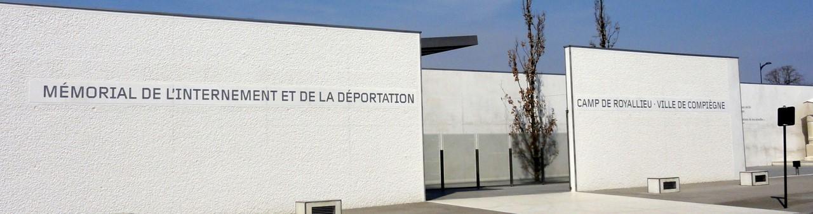
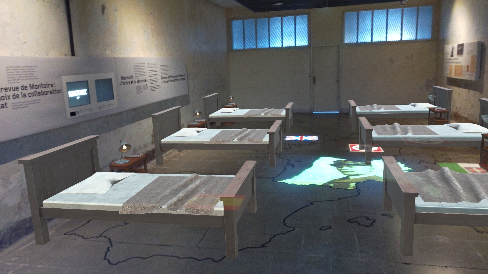
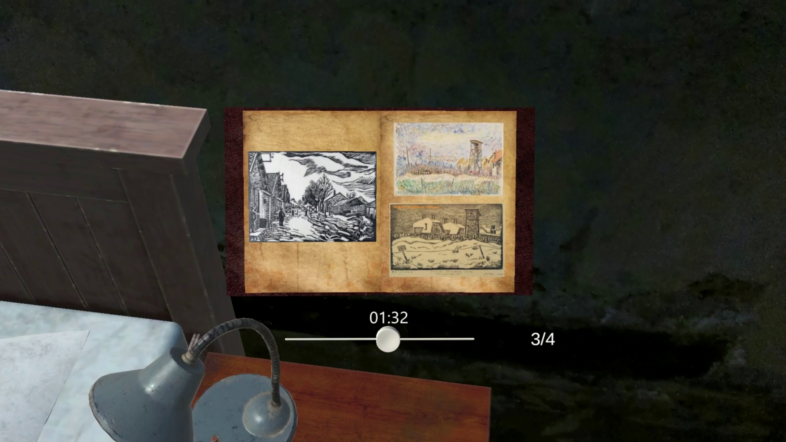

## The project 🚀
The Memorial Project is a collaboration between my engineering school (Université de Technologie de Compiègne) and the Memorial of Compiègne, which honors the victims of deportation during WWII.
It aims to use new technologies through HoloLens 2 to propose a new perspective on the Memorial's visit. It uses Mixed and Augmented Reality to reconstitute some rooms and spaces as they were during the camp's dark moments. Along with those reconstitutions, interactable objects are placed in the world, such as books. When being interacted with, they relate the stories of some individuals that were deported here.

## What I learned 🌟
- I worked only 2 weeks on this project, so I needed to quickly understand its architecture to produce my features
- As well as cleaning and refactoring some part of the code, I mainly worked on the interaction with the books by adding an outline when interaction is possible, activation animations and a swipe-like gesture to turn the book's pages in a natural way.

## Gallery 🖼️
|||
:-------------------------:|:-------------------------:
|Spatial anchors are used to revive the room as it was | The book's manipulation is smooth and simple |

## video 🎥
Here is a video presentation of the book interaction:

